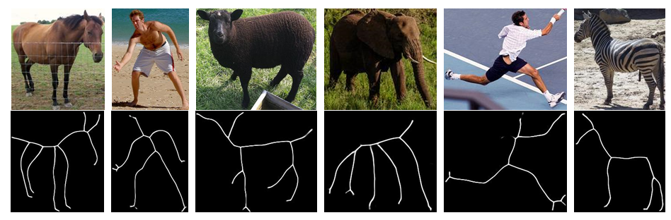
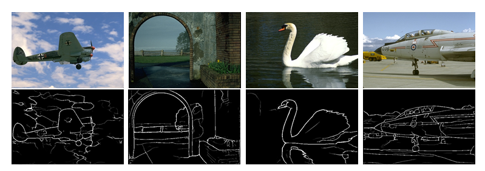
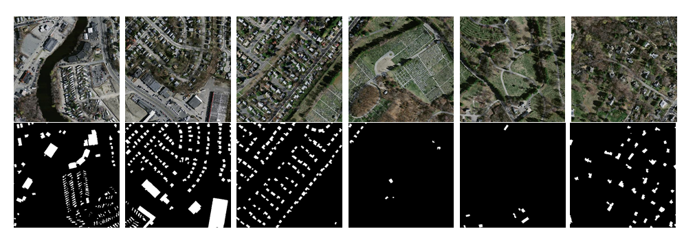
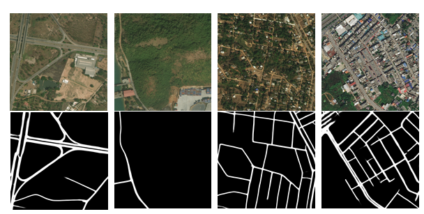

## SDL-Skeleton

   **SDL-Skeleton is a FREE toolbox for object skeleton detection, which also has strong adaptability to general pixel-wise binary classification tasks, such as edge detection, saliency detection, line detetection, building extraction and road extraction. This code is based on the implementation of  [HED](https://github.com/s9xie/hed) and [SRN](https://github.com/KevinKecc/SRN).**
   
SDL-Skeleton includes popular skeleton detection methods, including HED[1][https://github.com/s9xie/hed], SRN[2][], LSN[3][], HiFi[4][], DeepFlux[5][] and our newly proposed Ada-LSN. Ada-LSN achieved the state-of-the-art results across all skeleton dataset, for example, we achieved **0.786** performace on sklarge dataset.
   
<p align="center">
  
</p>
<p align="center">
Figure 1: Skeleton detection examples.
</p>

<p align="center">
  
</p>
<p align="center">
Figure 2: Edge detection examples.
</p>

<p align="center">
  
</p>
<p align="center">
Figure 3: Building extraction examples.
</p>

<p align="center">
  
</p>
<p align="center">
Figure 4: Road extraction examples.
</p>

## Requirements
- python 3
- pytorch >= 0.4
- torchvision

## Pretrained models

## Datasets
**Skeleton Detection**

  Five commonly used skeleton datasets are used, including [sklarge](https://kaizhao.net/sk-large)、[sk506](https://openaccess.thecvf.com/content_cvpr_2016/html/Shen_Object_Skeleton_Extraction_CVPR_2016_paper.html)、[sympascal](https://github.com/KevinKecc/SRN)、[symmax](https://link.springer.com/chapter/10.1007%2F978-3-642-33786-4_4) and [whsymmax](https://dl.acm.org/doi/10.1016/j.patcog.2015.10.015). You also can download all these datasets at [here](https://pan.baidu.com/s/1LbACSUxUrpyAZugNFz3WHQ), password:x9bd.
  
  The preliminary data augmentation code can be downloaded at [sklarge](https://kaizhao.net/sk-large), including resizing images to 3 scales (0.8x, 1.0x, and 1.2x), rotating for 4 directions (0◦, 90◦, 180◦,and 270◦), flipping in 2 orientations (left-to-right and up-to-down). After that, you can use resolution normalization technology (dataRN.py), which helps for skeleton detection because of their different image size.
  
 
 
 **Other tasks**
 
 We also test our methods on [edge detection](https://www.researchgate.net/publication/45821321_Contour_Detection_and_Hierarchical_Image_Segmentation), [building extraction](https://project.inria.fr/aerialimagelabeling/download/) and [road extraction](http://deepglobe.org/). 
## Usages
**Skeleton Detection**

Test HED and SRN by run:
```
python train.py --network 'hed'            # HED
python train.py --network 'srn'            # SRN
python train.py --network 'deep_flux'      # DeepFlux
```
At the same time, modify the saved path of the network model in engines/trainer.py. If you want to test DeepFlux, you also need to modify the data loader to use datasets/sklarge_flux.py. As for HiFi, we only implemented the network structure, with lacking the multi-scale annotation datasets.

Test Ada-LSN by run:
```
python train_AdaLSN.py
```
Our Ada-LSN supports different backbones, including VGG, ResNet, Res2Net and Inception. Simply modify the Ada_LSN/model.py to switch between different backbones. The performance of these different backbones on the sklarge dataset is as follows：
|backbones |  VGG  | ResNet50 | Res2Net | InceptionV3 |
|  ----    | ----  | -------- | ------- | ----------- |
| F-score  | 0.763 |  0.764   |  0.768  |  0.786      |

 **Other tasks**
 
 Our Ada-LSN also can be used for other pixel-wise binary classification tasks. We archieved state-of-the-art performace in edge detection and road extraction. We think Ada-LSN is also suitable for other tasks, for example, in subsequent experiments, we found Ada-LSN also works well on building extraction. You can use our method to simply modify the data path and run:
```
python train_AdaLSN.py
```
